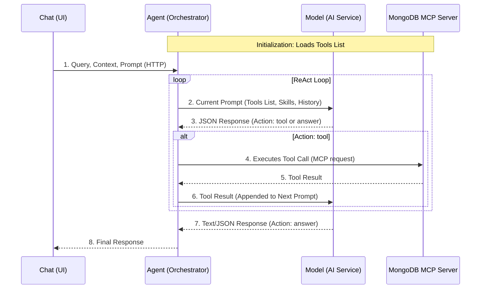

# MongoDB MCP Agent Architecture

Here is the current architectural diagram for the ReAct architecture in the MongoDB MCP Agent.

```mermaid
sequenceDiagram
    participant UI as Chat (UI)
    participant Agent as Agent (Orchestrator)
    participant Model as Model (AI Service)
    participant MCP as MongoDB MCP Server

    note over Agent,MCP: Initialization: Loads Tools List

    UI->>Agent: 1. Query, Context, Prompt (HTTP)
    
    loop ReAct Loop
        Agent->>Model: 2. Current Prompt (Tools List, Skills, History)
        Model-->>Agent: 3. JSON Response (Action: tool or answer)
        
        alt Action: tool
            Agent->>MCP: 4. Executes Tool Call (MCP request)
            MCP-->>Agent: 5. Tool Result
            Agent->>Model: 6. Tool Result (Appended to Next Prompt)
        end
    end
    
    Model-->>Agent: 7. Text/JSON Response (Action: answer)
    Agent-->>UI: 8. Final Response
```
